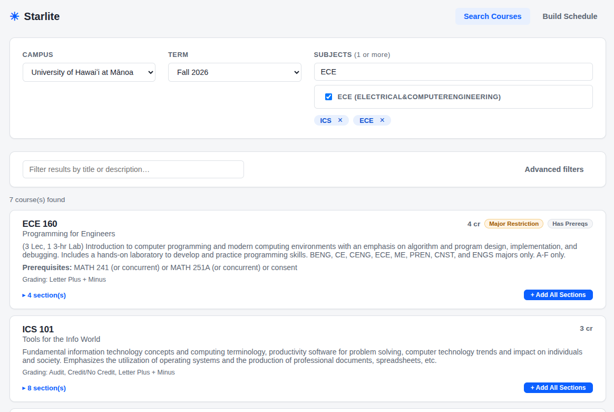
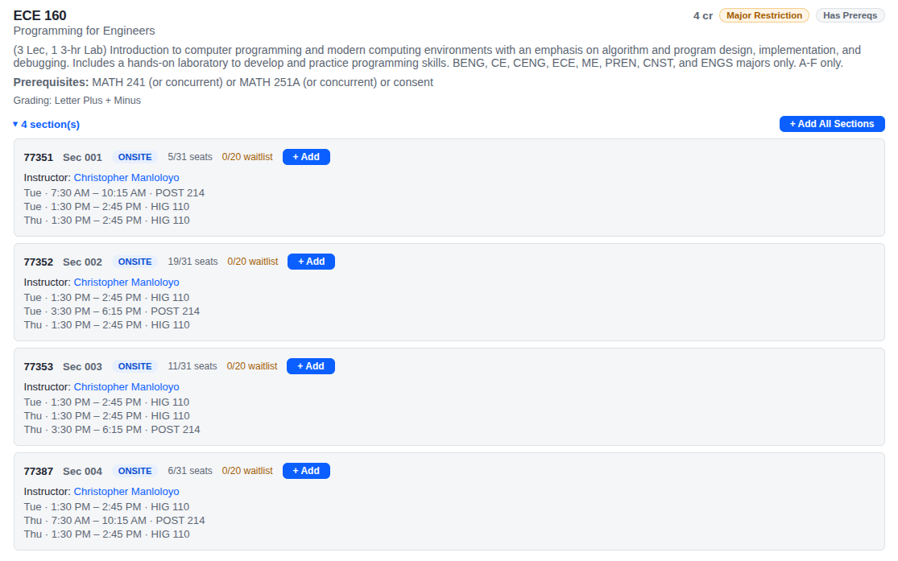
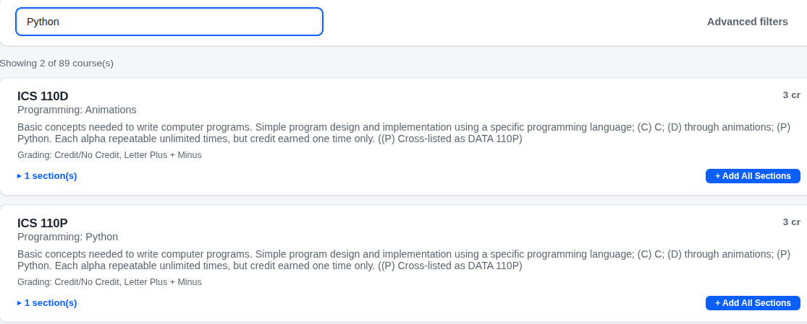
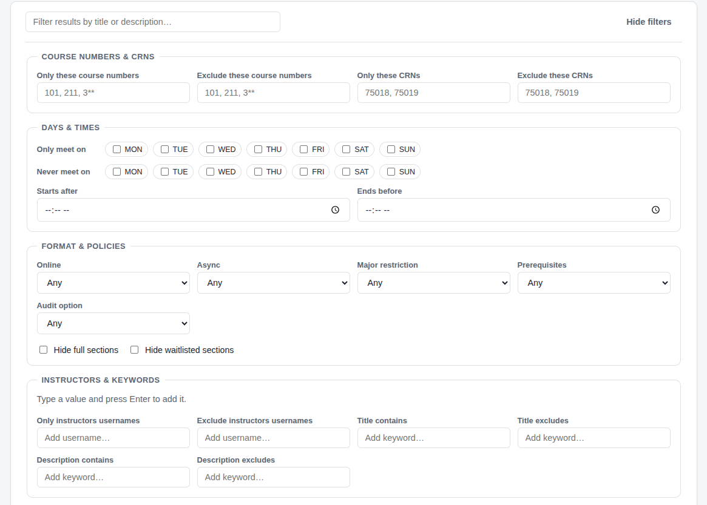
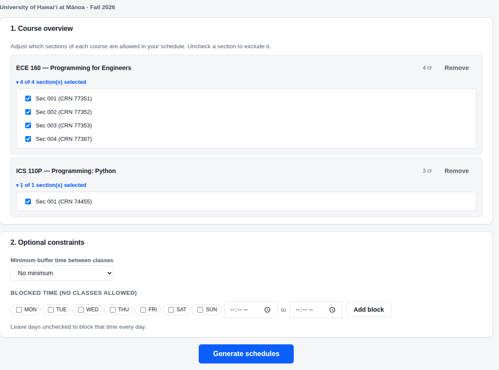
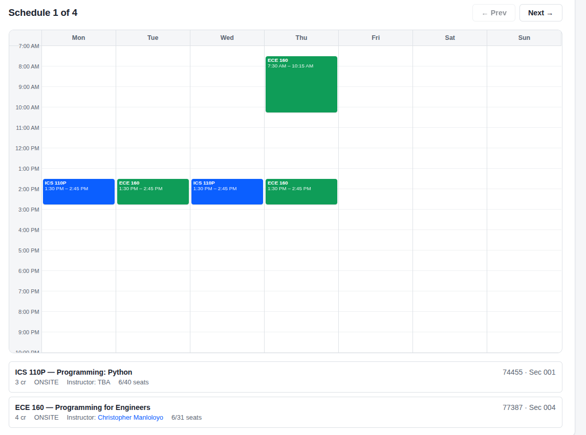

# 🌠 Starlite GUI

> Web app for searching course offerings University of Hawaiʻi and generating schedules

## Features

> Jump to [Quickstart](#quickstart) to get started

### Cross-Subject Course Search




- Search for multiple subjects for a campus and term and get details.

### Filtering Options



- Search in real time with keywords.



- Or use advanced course filtering options.

### Schedule Generation




- Generate all possible schedules, with support for reserved blocks and class buffer times

## Quickstart

Requires [Docker](https://docs.docker.com/engine/install/)

```bash
docker compose up
```

The starlite gui will be available at `http://localhost` after a few moments.

## Local Deployment

This app expects a running instance of the [starlite-api](https://github.com/dlg1206/starlite-api) at `http://localhost:8080`. Follow the [api readme](https://github.com/dlg1206/starlite-api#quickstart-guide) for details.

1. Clone the repo with submodules

```bash
git clone --recurse-submodules https://github.com/dlg1206/starlite
```

2. Install dependencies

```bash
npm install
```

3. Launch dev server

```bash
npm start
```

The starlite gui will be available at `http://localhost:4200`
