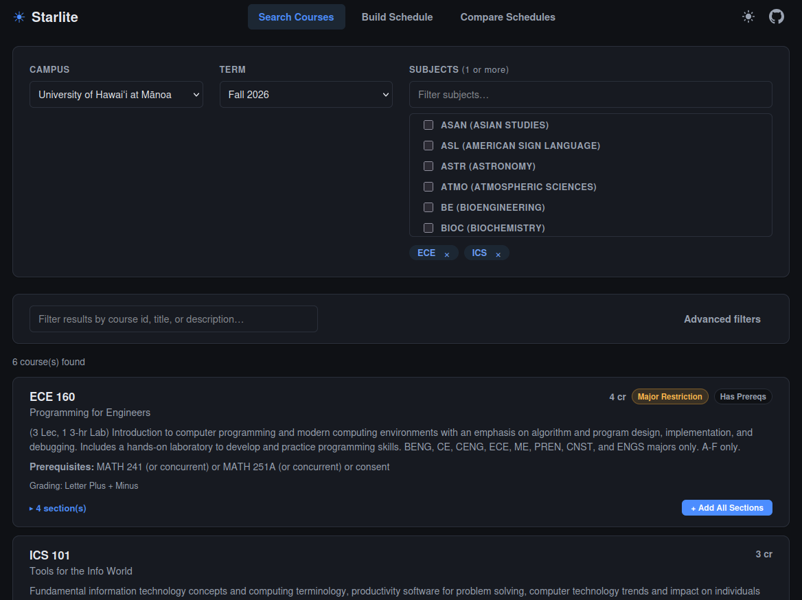
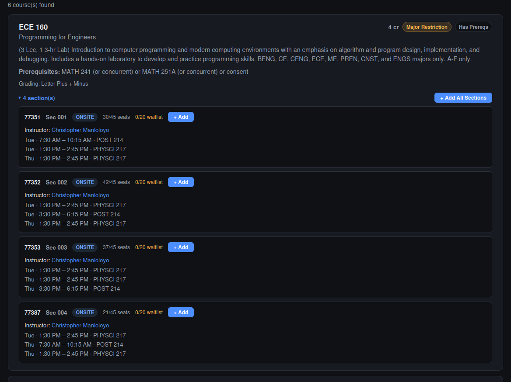
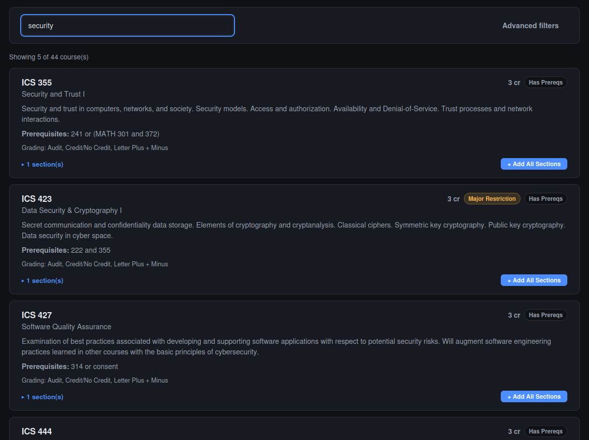
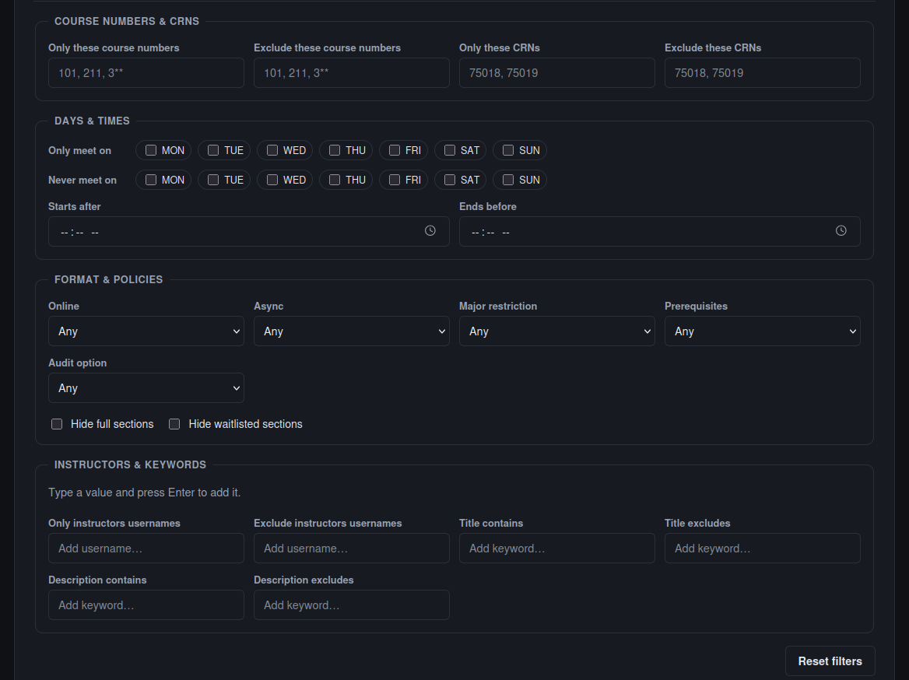
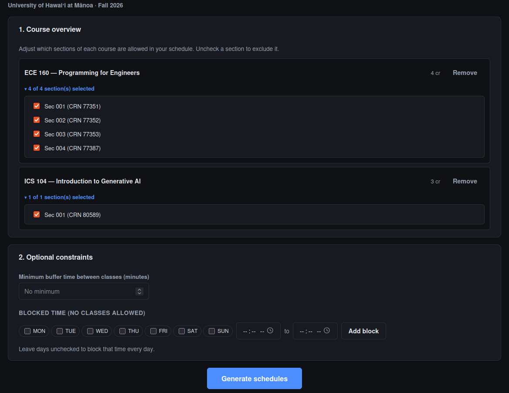
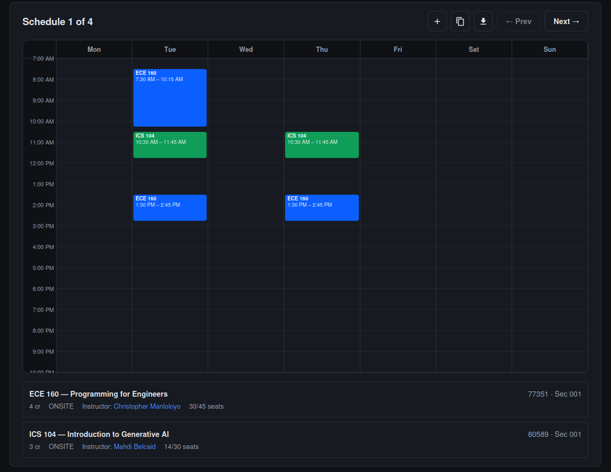
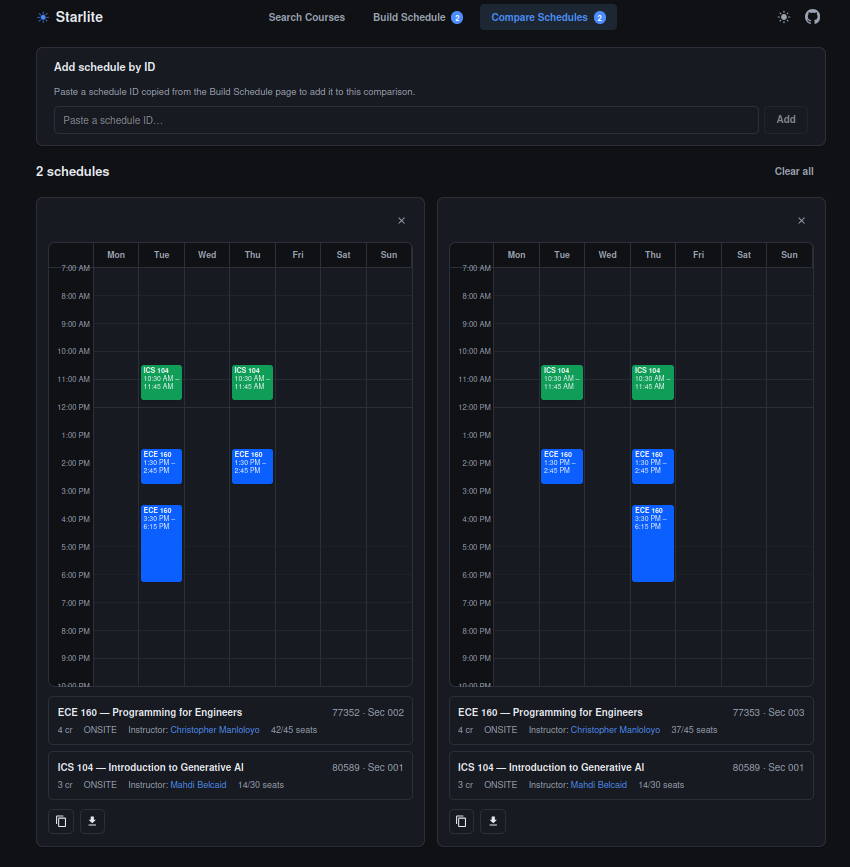

<h1>
    
    Starlite
</h1>

> Web app for searching for courses offered and generating schedules for all ten campuses at the [University of Hawai'i](https://www.hawaii.edu/)

- Search for courses across multiple subjects
- Real-time and advanced filtering options
- Automated schedule generation
- Compare different schedules
- Export schedules as ICalander files

## Feature Overview

> Jump to [Quickstart](#quickstart) to get started

### Cross-Subject Course Search




- Search for multiple subjects for a campus and term and get details.

### Filtering Options



- Search in real time with keywords.



- Or use advanced course filtering options.

### Schedule Generation




- Generate all possible schedules, with support for reserved blocks and class buffer times
- Download generated schedules as an [ICalender](https://en.wikipedia.org/wiki/ICalendar) file that can be imported into [Google Calendar](https://support.google.com/calendar/answer/37118), [Apple Calendar](https://support.apple.com/guide/calendar/import-or-export-calendars-icl1023/mac),[Outlook](https://support.microsoft.com/en-us/outlook/import-or-subscribe-to-a-calendar-in-outlook-com-or-outlook-on-the-web), and other calendar software.



- Compare different schedules

## Quickstart

> Start a live deployment to get realtime course data
>
> Requires [Docker](https://docs.docker.com/engine/install/)

1. Clone the repo with submodules

```bash
git clone --recurse-submodules --shallow-submodules https://github.com/dlg1206/starlite
```

2. Launch compose stack

```bash
docker compose up
```

The starlite gui will be available at [`http://localhost`](http://localhost) after a few moments.

### Offline mode

> Deploy using an offline cache. Schedule services will be unavailable
>
> Requires [Docker](https://docs.docker.com/engine/install/)

1. Clone the repo with submodules

```bash
git clone --recurse-submodules --shallow-submodules https://github.com/dlg1206/starlite
```

2. If `npm` is installed, run:

```bash
npm run fetch:offline-data
```

else run the script directly

```bash
./scripts/update-cache.sh
```

> [!WARNING]
> Fetching all data will take 3-4 minutes. This will only need to be once or when checking for updates

3. Once the script finishes, launch the compose stack

```bash
docker compose --profile offline up --build web-offline
```

The starlite gui will be available at [`http://localhost`](http://localhost) after a few moments.

## Local Deployment

**Prerequisites**

- `node` >= 20
- `npm` >= 10

1. Clone the repo with submodules

```bash
git clone --recurse-submodules https://github.com/dlg1206/starlite
```

This app expects a running instance of the [starlite-api](https://github.com/dlg1206/starlite-api) at `http://localhost:8080`. Follow the [api readme](https://github.com/dlg1206/starlite-api#quickstart-guide) for details or if just need a running instance:

```bash
docker compose build api && docker run --rm -p 8080:8080 starlite-api
```

2. Install dependencies

```bash
npm install
```

3. Launch dev server

```bash
npm start
```

The starlite gui will be available at [`http://localhost:4200`](http://localhost:4200)

### Offline mode

**Prerequisites**

- `java` >= 25
- `node` >= 20
- `npm` >= 10


1. Clone the repo with submodules

```bash
git clone --recurse-submodules https://github.com/dlg1206/starlite
```

2. Install dependencies

```bash
npm install
```

3. Fetch offline cache

```bash
npm run fetch:offline-data
```

else run the script directly

```bash
./scripts/update-cache.sh
```

> [!WARNING]
> Fetching all data will take 3-4 minutes. This will only need to be once or when checking for updates

4. Launch dev server

```bash
npm start:offline
```

The starlite gui will be available at [`http://localhost:4200`](http://localhost:4200)
